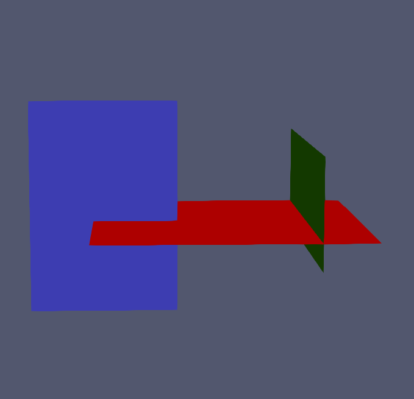
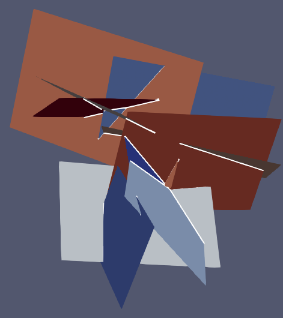
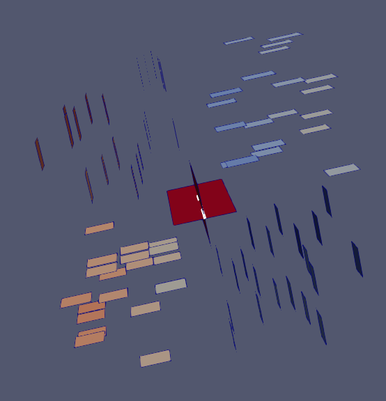

<p align="center">
<span style="font-size:40px;">
Progetto PCS 2024
</span>
</p>
<p align="center">
S. Berrone, M. Cicuttin, G. Teora e F. Vicini
</p>
<p align="center">
30/04/2024
</p>


# Discrete Fracture Network

Un Discrete Fracture Network (DFN) è un sistema costituito da $N$ **fratture** $F_n$, $n \in \{1, \dots, N\}$ rappresentate da poligoni planari che si intersecano tra di loro nello spazio tridimensionale, si veda un esempio nelle figure successive. 
Le $M$ intersezioni tra le fratture $T_m$, $m \in \{1, \dots, M\}$, chiamate di seguito **tracce**, possono essere identificate da un segmento, supponendo di non considerare le tracce di misura nulla. 
Per ciascuna frattura, una traccia può essere **passante** o **non-passante**. 
Una traccia passante per una frattura è un segmento con entrambi gli estremi che giacciono sul bordo della frattura stessa. 
Al contrario, una traccia non-passante per una frattura  è un segmento che ha almeno un suo estremo all'interno della frattura stessa.
Maggiori dettagli riguardo alla procedura con cui tali sistemi vengono generati possono essere reperiti in [[1]](#1).

Nel seguito assumeremo che:

- la frattura $F_n$ è rappresenta univocamente da poligoni convessi semplici definiti da $V$ vertici non allineati ordinati in senso antiorario;
- la traccia $T_m$ è condivisa da esattamente due fratture $T_m := F_i \cap F_j$. Esiste pertanto una relazione biunivoca tra l'identificatore della traccia $m$ e la coppia degli indici delle fratture $(i, j)$ che la definiscono.


Nella cartella *Progetto_PCS_2024/Project/DFN* sono contenuti $6$ esempi di DFN costituiti da 3, 10, 50, 82, 200 e 362 fratture, rispettivamente. 
Tali DFN differiscono per il numero di tracce che generano, variando da scenari più realistici con un numero elevato di tracce a scenari meno probabili in cui il numero di intersezioni di fratture è davvero molto esiguo.

DFN con 3 fratture         | DFN con 10 fratture            |  DFN con 82 fratture  
:-------------------------:|:-------------------------------:|:-------------------------------:
 |  |  


## Svolgimento

Il progetto è costituito da due parti descritte nel seguito.

Dato in input un DFN:

1. Determinare le $M$ tracce del DFN. 
Per ciascuna frattura, differenziare le tracce in passanti e non-passanti.
Infine, per ciascuna frattura ordinare separatamente i due sottoinsiemi di tracce passanti e non-passanti per lunghezza in ordine decrescente;
2. Per ciasscuna frattura, determinare i sotto-poligoni generati dal taglio della frattura con le sue tracce. Procedere al taglio della frattura seguendo prima l'ordine prestabilito dall'insieme di tracce passanti e successivamente quello delle tracce non-passanti.

Lo svolgimento della sola prima parte consente di arrivare ad un punteggio massimo di 28.
Lo svolgimento di entrambe le parti consente di arrivare ad un punteggio massimo di 30L.

Ai fini di una valutazione positiva, è necessario aver consegnato:

1. Il codice sorgente C++ del progetto.
2. Una tesina di al massimo 10 pagine in cui si descrivono i principali ragionamenti seguiti per rendere efficiente il codice e la relativa documentazione UML che descrive le unità logiche definite nel codice sorgente.

Infine, all'orale occorre portare una presentazione con slide dalla durata massima di **10 minuti** per gruppo. I gruppi possono essere costituiti da al massimo **tre persone**.

Il codice sorgente dovrà essere consegnato su una repository GitHub condivisa da tutti i membri del gruppo. 
Il link della repository dovrà essere consegnato sulla pagina *Elaborati* del portale insieme al report. Il file txt contenente il link dovrà essere denominato "ProgettoPCS2024_GitHub_*Nome*_*Cognome*.txt" e il report dovrà essere denominato "ProgettoPCS2024_Report_*Nome*_*Cognome*.pdf". Dunque, ogni membro del gruppo dovrà condividere il link alla repository e il report in maniera indipendente sul portale.

**IMPORTANTE**: il materiale dovrà essere consegnato una settimana prima della prova orale e comunque non oltre il 31 luglio 2024, seguendo l'usuale modalità di consegna.
Fa fede la data di consegna sul portale.


## Parte 1 - Determinare le tracce di un DFN - Punteggio: 2 punti

Sviluppare un codice C++ che identifichi le tracce di un DFN. Tale codice dovrà:

- Leggere un DFN da file. Il formato del file è il seguente: ogni file contiene le informazioni che caratterizzano un DFN: il numero di fratture e la lista di fratture. Per ciascuna frattura è riportato l'identificativo e il numero dei vertici, seguiti dalla lista dei vertici descritti come una matrice di dimensioni `3 x numero dei vertici`. Di seguito è riportato un esempio del formato:

\small

```text
# Number of Fractures                                                            
10                                                                                                
# FractureId; NumVertices                                                                         
0; 4                                                                                             
# Vertices                                                                                        
6.7949650570084286e-01; 2.0959413133064569e-01; 7.7027229455623514e-02; 5.4692960382582068e-01  
5.1566886122886846e-01; 9.9389350435296486e-01; 8.6363358811981283e-01; 3.8540894499571632e-01  
1.9054542365205804e-01; 1.9054542365205804e-01; 5.9704177318758545e-01; 5.9704177318758545e-01  
# FractureId; NumVertices                                                                         
1; 4                                                                                            
# Vertices                                                                                       
5.5952856500448900e-01; 1.2850957640097640e+00; 1.2754369312946789e+00; 5.4986973228940383e-01  
3.0734730003609312e-01; 3.9378095860229478e-01; 4.7486201330943967e-01; 3.8842835474323800e-01  
-8.6619310585948128e-02; -8.6619310585948128e-02; 3.9361989787461205e-01; 3.9361989787461216e-01 
# FractureId; NumVertices                                                                         
....                                                                                       

```

\normalsize

- Calcolarne le tracce. Per ogni traccia il programma dovrà memorizzare la coppia degli identificativi delle fratture che la definiscono e le coordinate tri-dimensionali dei punti che la identificano. Il risultato andrà stampato su un file del seguente formato

```text
# Number of Traces
...(value)
# TraceId; FractureId1; FractureId2; X1; Y1; Z1; X2; Y2; Z2 
...(values)                                                      
```

- Per ciascuna frattura, differenziare le tracce in passanti e non-passanti. 
Ordinare i due sotto-insiemi separatamente per lunghezza (decrescente). In particolare, introdurre una variabile **Tips** definita come un booleano che indica se la traccia per quella data frattura è passante (false) oppure non-passante (true). Il risultato dovrà essere stampato in un file del seguente formato:
```text
# FractureId; NumTraces  
...(values)
# TraceId; Tips; Length
...(values)                                                      
```

- Testare le varie unità logiche presenti nel codice tramite i `GoogleTest`.

- E\' richiesta una particolare attenzione nell'introdurre delle condizioni che escludano la probabilità che due fratture si intersechino, evitando così il costo relativo alla risoluzione dei sistemi lineari necessari per il calcolo delle tracce.


## Parte 2 - Determinare i sotto-poligoni generati per ogni frattura - Punteggio: 2 punti

Dopo aver determinato le tracce, definire un oggetto di tipo PolygonalMesh per ogni frattura che memorizzi i vertici, i lati e i poligoni generati dal taglio della frattura con le sue tracce. 
In particolare, tale struttura dovrà memorizzare:

- Il numero delle celle 0D, 1D e 2D.
- Per ogni cella 0D: un identificativo e le coordinate 3D.
- Per ogni cella 1D: il proprio identificativo e gli identificativi delle celle 0D che lo delimitano.
- Per ogni cella 2D: il numero e la lista degli idnetificativi dei vertici e dei lati che la definiscono. I vertici e i lati dovranno essere memorizzati seguendo l'ordinamento anti-orario. 

Ogni frattura andrà tagliata considerando prima le tracce passanti (in ordine decresscente di lunghezza) poi quelle non-passanti (in ordine decresscente di lunghezza). 
Per il taglio con la traccia non-passante, essa andrà prolungata fino ad incontrare i lati del sotto-poligono in cui si trova.

Ad esempio, nella frattura rossa relativa al "DFN con 3 fratture" si origineranno 3 poligoni:

- prima si origineranno 2 poligoni ($PSX$ e $PDX$) dal taglio con la frattura passante (verde).
- poi la sotto-frattura di sinistra $PSX$ verrà tagliata in ulteriori due parti, prolungando la traccia generata dalla frattura blu fino al segmento che rappresenta la traccia generata dall'intersezione con la frattura verde.


# Bibliografia

<a id="1">[1]</a> 
S. Berrone, C. Canuto, S. Pieraccini, S. Scialò. "Uncertainty Quantification in Discrete Fracture Network Models: Stochastic Geometry". Water Resources Research 54 (2): 1338-52. https://doi.org/10.1002/2017WR021163.


